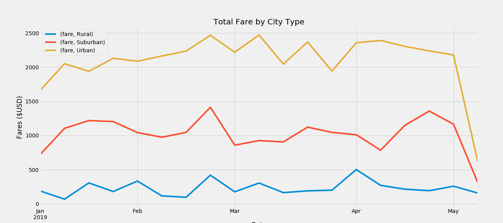

# PyBer_Analysis

# Overview of Analysis
The purpose of this analysis is to explore PyBers existing ride-share data to better understand trends that will help PyBer allocate resources and plan for the future. The main focus of this analysis was filtering the data into groups by city type (Urban, Suburban, Rural), to better understand how PyBer is performing in areas of different population densities. 

# Results 

- As expected, we see a highest number of drivers and total rides in urban cities, with the least in rural cities
- Riders in rural cities paid the highest average fare per each ride, while urban riders on average paid the lowest fare per ride
- The average fare per driver in rural cities was more than three times higher than the average fare per driver in urban cities

- This figure shows the total amount of fares paid each week, by city type
- While there are fluctuations week-to-week in terms of total fares paid, the city types seem to move in proportion

# Summary 

Recommendations to PyBer:
- Focus on raising the number of drivers in rural areas. With an increase in the number of drivers, fares will start to decrease and likely make rural consumers more likely to use PyBer.
- Use marketing strategies to increase brand awareness in rural and suburban cities.
- Incentivize rural and suburban customers to start using PyBer with first-time user discount, encourage spread by offering further discounts for sharing discount code with other first-time users. 
